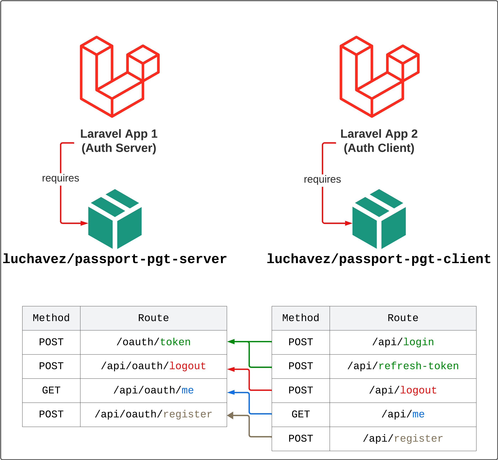
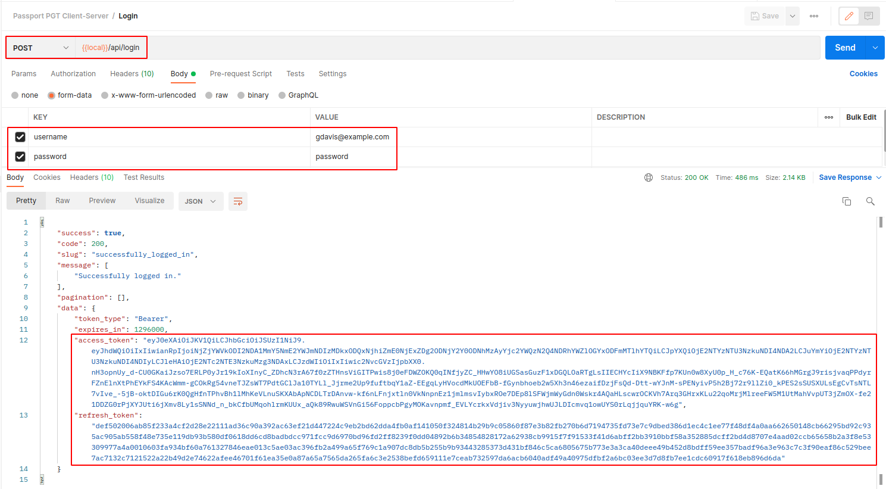
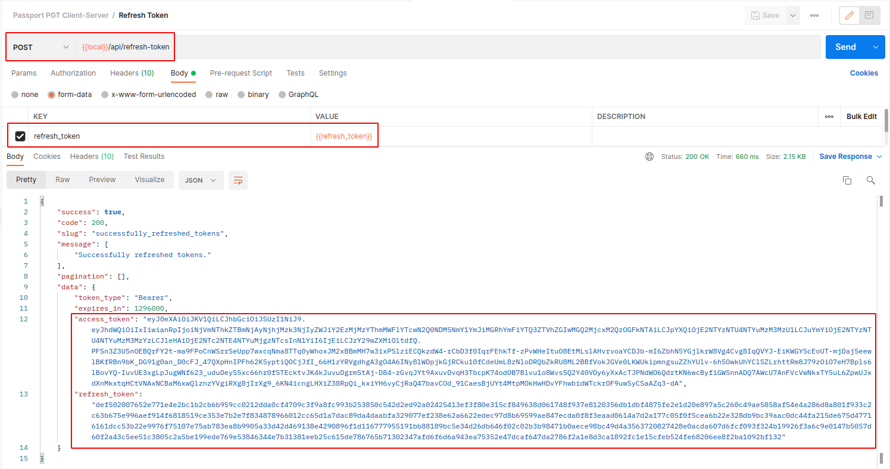
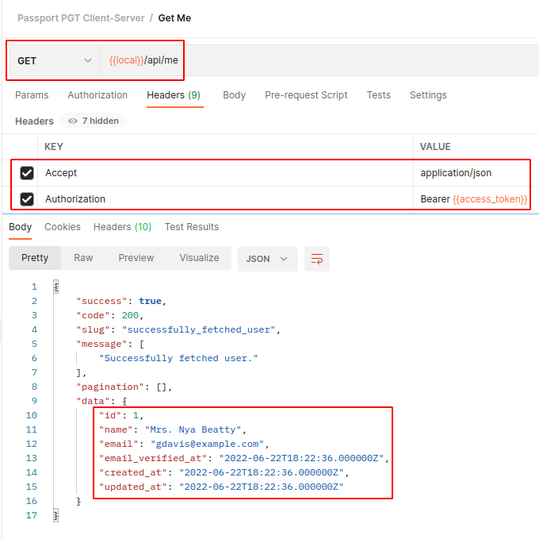
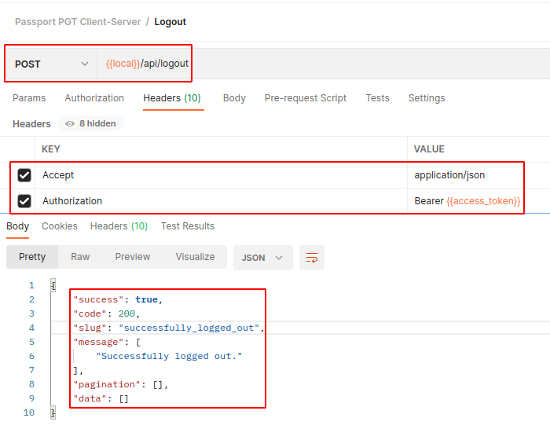

# Passport Password Grant Tokens (PGC) Client for Laravel 8|9|10

[![Latest Version on Packagist][ico-version]][link-packagist]
[![Total Downloads][ico-downloads]][link-downloads]
[![GitHub Repo stars][ico-stars]][link-stars]
[![Discord][ico-discord]][link-discord]
[![Twitter Follow][ico-twitter]][link-twitter]

**Laravel Passport** is an authentication package for Laravel. It is used by a lot of Laravel apps to authenticate users before accessing any resources. Basically, it generates an `access token` which you can then use on every request to provide identification to the `OAuth Server`.

One of Laravel Passport's mostly used authentication methods is the [`Password Grant Tokens`](https://laravel.com/docs/8.x/passport#password-grant-tokens) grant type. It is a stateless way to get `access tokens` and `refresh tokens` from the `OAuth Server`.

Take a look at [contributing.md](contributing.md) if you want to contribute to this project.



## Installation

Via Composer

``` bash
// Install the package
$ composer require luchavez/passport-pgt-client

// Publish the config
$ php artisan pgt:client:install
```

## Setting Up

1. Add these variables to `.env` file if you want to override the default values.

| Variable Name                           | Default Value       | Description                    |
|-----------------------------------------|---------------------|--------------------------------|
| `PASSPORT_URL`                          | `config('app.url')` | URL of Authentication Server   |
| `PASSPORT_PASSWORD_GRANT_CLIENT_ID`     | null                | Password grant client's ID     |
| `PASSPORT_PASSWORD_GRANT_CLIENT_SECRET` | null                | Password grant client's secret |

## Usage

### Passport PGT Client

The package provides a service called [**PassportPgtClient**](src/Services/PassportPgtClient.php) which you can use by calling its [helper functions](helpers/passport-pgt-client-helper.php):
1. `passportPgtClient()`
2. `passport_pgt_client()`

Here's the list of its available methods.

| Method Name                    | Return Type                                                             | Description                                                          |
|--------------------------------|-------------------------------------------------------------------------|----------------------------------------------------------------------|
| `getPassportUrl`               | `string`                                                                | gets the URL of Authentication Server                                |
| `getPasswordGrantClientId`     | `string or int or null`                                                 | gets the Password Grant Client's id                                  |
| `getPasswordGrantClientSecret` | `string or null`                                                        | gets the Password Grant Client's secret                              |
| `register`                     | `Luchavez\ApiSdkKit\Models\AuditLog or Illuminate\Http\Client\Response` | sends POST request to Auth Server's `/oauth/token` to login          |
| `login`                        | `Luchavez\ApiSdkKit\Models\AuditLog or Illuminate\Http\Client\Response` | sends POST request to Auth Server's `/oauth/token` to login          |
| `refreshToken`                 | `Luchavez\ApiSdkKit\Models\AuditLog or Illuminate\Http\Client\Response` | sends POST request to Auth Server's `/oauth/token` to refresh tokens |
| `logout`                       | `Luchavez\ApiSdkKit\Models\AuditLog or Illuminate\Http\Client\Response` | sends POST request to Auth Server's `/api/oauth/logout` to logout    |
| `getSelf`                      | `Luchavez\ApiSdkKit\Models\AuditLog or Illuminate\Http\Client\Response` | sends GET request to Auth Server's `/api/oauth/me` to get user info  |

### Routes

Here's the list of routes that this package provides.

| Method | Route                | Description                                                                       |
|--------|----------------------|-----------------------------------------------------------------------------------|
| POST   | `/api/register`      | This route sends POST request to Auth Server's `/api/oauth/register` to register. |
| POST   | `/api/login`         | This route sends POST request to Auth Server's `/oauth/token` to login.           |
| POST   | `/api/refresh-token` | This route sends POST request to Auth Server's `/oauth/token` to refresh tokens.  |
| POST   | `/api/logout`        | This route sends POST request to Auth Server's `/api/oauth/logout` to logout.     |
| GET    | `/api/me`            | This route sends GET request to Auth Server's `/api/oauth/me` to get user info.   |

*Note*: If you wish to override the login, refresh token, logout, or get self logic, feel free to do so by updating the published `passport-pgt-client` config file.

### Examples

- Logging in a user



- Refreshing tokens



- Getting user's information based on access token



- Logging out a user



## Change log

Please see the [changelog](changelog.md) for more information on what has changed recently.

## Testing

``` bash
$ composer test
```

## Contributing

Please see [contributing.md](contributing.md) for details and a todolist.

## Security

If you discover any security related issues, please email jamescarloluchavez@gmail.com instead of using the issue tracker.

## Credits

- [James Carlo Luchavez][link-author]
- [All Contributors][link-contributors]

## License

MIT. Please see the [license file](license.md) for more information.

[ico-version]: https://img.shields.io/packagist/v/luchavez/passport-pgt-client.svg
[ico-downloads]: https://img.shields.io/packagist/dt/luchavez/passport-pgt-client.svg
[ico-stars]: https://img.shields.io/github/stars/luchavez-technologies/passport-pgt-client
[ico-discord]: https://img.shields.io/discord/1143744619956404295?color=8c9eff&label=Discord&logo=discord
[ico-twitter]: https://img.shields.io/twitter/follow/luchaveztech

[link-packagist]: https://packagist.org/packages/luchavez/passport-pgt-client
[link-downloads]: https://packagist.org/packages/luchavez/passport-pgt-client
[link-stars]: https://github.com/luchavez-technologies/passport-pgt-client
[link-discord]: https://discord.gg/MBxxAkQAxx
[link-twitter]: https://twitter.com/luchaveztech

[link-author]: https://github.com/luchavez-technologies
[link-contributors]: ../../contributors
